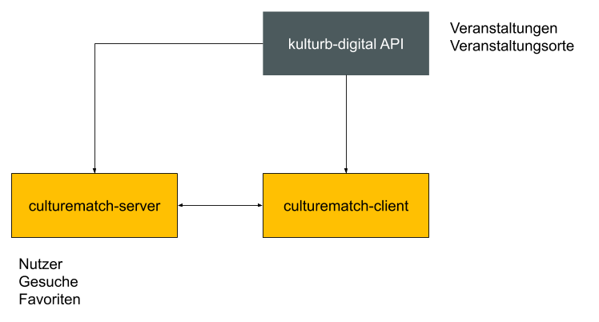

# CULTUREmatch API

## Table of contents

* [Local development with Vagrant](#local-development-with-vagrant)
  * [Required dependencies](#required-dependencies)
  * [Initial setup](#initial-setup)
  * [Fire up already initialized Vagrant box](#fire-up-already-initialized-vagrant-box)
* [API explorer](#api-explorer)
* [Auth](#auth)
  * [Email and password](#email-and-password)
  * [Email verification](#email-verification)
  * [Brute force protection](#brute-force-protection)
* [Admin panel](#admin-panel)
* [Caching](#caching)
* [Dynamic images](#dynamic-images)
* [Email](#email)
* [Storage](#storage)
* [Provisioning and Deployments](#provisioning-and-deployments)
  * [Provisioning](#provisioning)
  * [Deployments](#deployments)

## Overview


This API connects to the KulturBDigital API.
 
## Local development with Vagrant

### Required dependencies

* Vagrant >= 2.0.8
* VirtualBox >= 5.2.8

### Initial setup

(required only once)

1. Create `vagrant-config.json` from the example file in the project root:
    * Change the `devUrl` to `<projectname>.hacking`
    * Change the last chunk of the ```ip``` to an unique ip you do not already have a Vagrant box assigned to in your local hosts file
1. run `vagrant up` in the project root which will take some time on first setup
1. Check the console output for instructions and add the new entry to your hosts file on your local machine (the host machine, on macOS run `sudo nano /etc/hosts`)
1. run `vagrant ssh` to log into the Vagrant box via ssh and make sure you run the following commands from within your Vagrant box
    1. The project root will be in `app/`, so just run `cd app/`
    1. run `npm i`
    1. You might have to configure or remove some of the built-in auth providers bevore proceeding, see [Auth](#auth) for mor information.
    1. run `node bin/autoupdate-all.js` to update the database
    1. run `nodemon .` to start the api server. The API will be available on `<projectname>.hacking` from outside the Vagrant box
    1. run `logout` and `vagrant halt` to shut down the Vagrant box

### Fire up already initialized Vagrant box

1. run `vagrant up`
1. run `vagrant ssh` to log into the Vagrant box via ssh and make sure you run the following commands from within your Vagrant box
    1. The project root will be in `app/`, so just run `cd app/`
    1. run `npm i`
    1. run `node bin/autoupdate-all.js` (only necessary when models have been changed, after git pull for example)
    1. run `nodemon .` to start the api server. The API will be available on `<projectname>.hacking` from outside the Vagrant box
    1. run `logout` and `vagrant halt` to shut down the vagrant box

## API explorer

You can find a swagger API explorer on `http(s)://<your-domain>/explorer`.\
User: explorer\
Password: Proto2014type

The default password can be changed in the `.env` file.

## Auth

### Email and password

Login and Registration with email/password is located on the `/users` endpoint.

### Email verification

The `AppUser`model has email verification built in and enabled by default. This can be disabled by setting `customOptions.needsEmailVerification =  false` in the model definition (`app-user.json`)

### Brute force protection

All auth endpoints are protected agains brute force attacs by default with a custom rate-limiter middleware (`server/middleware/rate-limiter.js`). This middleware can be configured in the `.env` file.

## Admin panel

When being deployed on a server proto-admin will be automagically included and is available under `https://<your-domain>/admin`. The models for the admin panel can be configured in `server/proto-admin-config.json`. For more information please check the proto-admin docs.

On Vagrant the admin panel is not available at the moment, but can be cloned/downlaoded and locally used as a separate project. You just have to modify the hacking environment in the admin panel to point to your local Vagrant box.

## Caching

A caching mixin is availbale by default, but not activated for any model. To use caching for models follow the instructions in [the mixin's docs](https://github.com/prototype-berlin/loopback-mixin-cache#readme).

## Dynamic images

This starter serves all images dynamically by default. To get an image use the following url: `https://<your-domain>/api/files/<fileId>/download`. This dynamically provides the image in the biggest available resolution up to the in `server/config.json` max dimensions.

To get different, dynamically rendered versions of an image you can use the following query params:

* `width<number>`
* `height<number>`
* `square<number>`: to get a square version, same result as setting width and hight to the same value
* `quality<number>`: defaults to 80, can be changed in `server/config.json
* `crop<boolean>`: defaults to true which means if width and height are both present, image will be croped

If the requested file is not an image or any of the above params are not available for the mime type, the params are just being ignored by the API.

## Email

This project uses a custom email queue based on Redis for sending emails (`server/queue/mail-queue.js`). The used smtp server can be configured in the `.env` file.

## Storage

By default uploaded files are being stored in `server/storage/`, but any S3 compatible storage service can be used by changing th configuration in `server/config.json`.

## Provisioning and Deployments

### Provisioning

To provision a new server run the following command and follow the instructions:

```bash
sh bin/provision.sh
```

After the script completed the provisioning successfully you will have to save the automatically generated passwords.

### Deployments

This starter uses GitLab CI. Modify .gitlab-ci.yml to add additional deployments.
